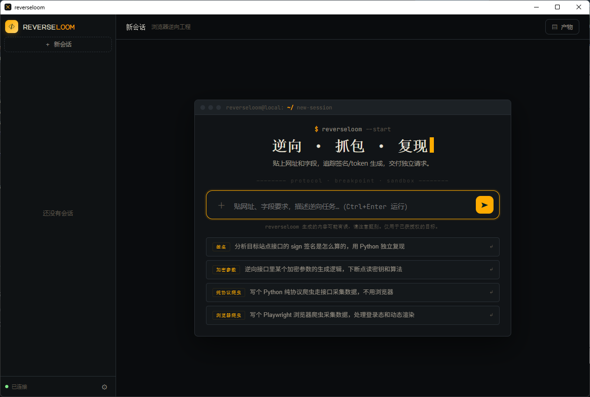
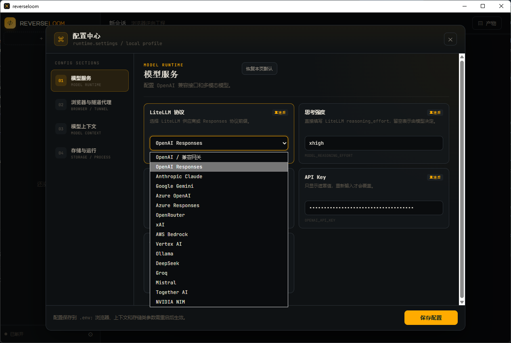
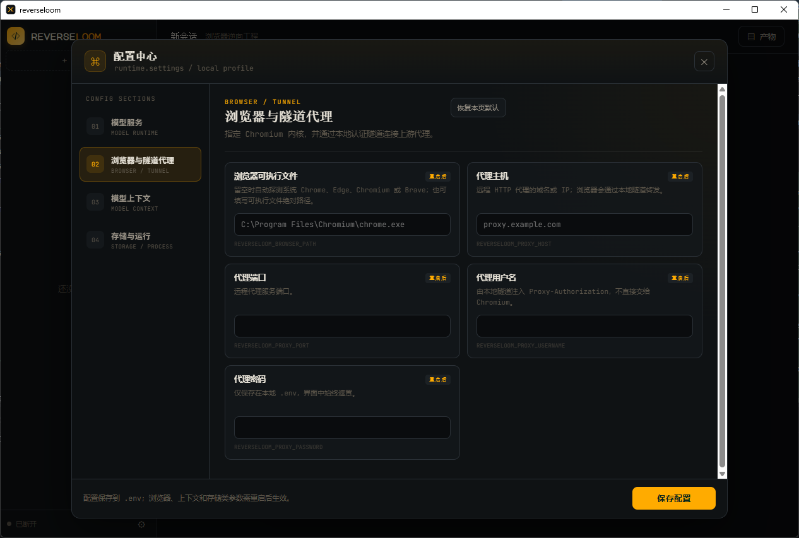

<div align="center">


# reverseloom

### 🕸️ Hand the whole browser to an LLM — it gets in, reverses the protocol, and writes a crawler that runs without a browser.

**Local · open-source · with a desktop UI.** Say "I want this site's data," and its **observer architecture** lays the browser fully open to the model — DOM, screenshot, every network request, the live JS breakpoint state — so it can **get past bot detection, set CDP breakpoints to extract the sign/encryption algorithm, reproduce it offline in a sandbox, and deliver a crawler that passes a cold start**. Woven on [graphloom](https://github.com/KuiChi-x/graphloom); pair it with [kc-browser](https://github.com/KuiChi-x/kc-browser)'s kernel-level fingerprint browser to reach any site.

[](https://www.python.org/)
[](https://github.com/KuiChi-x/graphloom)
[](https://github.com/Kaliiiiiiiiii-Vinyzu/patchright)
[](https://github.com/KuiChi-x/kc-browser)
[](LICENSE)


[](https://github.com/KuiChi-x/reverseloom/releases)

[中文](README.zh-CN.md) · **English** · [Three walls](#three-walls) · [Full power](#full-power) · [Quick start](#quick-start) · [Capabilities](#capabilities)

</div>

<div align="center">

<!-- 📹 Record a demo, save it to docs/demo.gif, and uncomment the next line to replace the static screenshot below -->
<!--  -->


_Type one line in the desktop UI. Watch it reason, drive the browser, set breakpoints, reproduce the algorithm, and produce a crawler — live on the right._

</div>

---

> 🧵 **Powered by [graphloom](https://github.com/KuiChi-x/graphloom)** — the agent framework behind reverseloom's observer architecture, context compaction, and progressive skills. If reverseloom is useful, a ⭐ on graphloom helps too — it's the engine underneath.

## 💡 In one line

Most browser agents feed the model only "a screenshot + clickable elements," so they stop at "click this button for me."

**reverseloom uses an observer architecture to lay the browser fully open to the model** — the DOM, the screenshot, every network request, even the live JS debugger state, all injected as "the browser right now." That lets it do two jobs:

- 🤖 **As a browser agent**: navigate, click, fill forms, beat captchas, work across tabs, scrape data — the usual, done well.
- 🔬 **As a reverse-engineer**: when data is guarded by a signature / token / encrypted body, it sets CDP breakpoints, traces back to the generator, drags it into a Node sandbox to reproduce it offline, and delivers a crawler that **runs cold — no browser required**.

From "I can scrape what I can see" to "I can reverse what I can't." That's the payoff of exposing the *whole* browser to the model.

<a id="three-walls"></a>

## 🧱 Scraping has three walls. reverseloom tears through all of them in one stack.

Anyone who's built a scraper knows there are three walls between you and the data. Most tools clear only one. reverseloom welds all three into **a single pipeline**:

| | The wall | The usual way | reverseloom's one-stack answer |
|---|---|---|---|
| 🧱 **Wall 1** | **Can't get in** — the site detects an automated browser and blocks you | hand-patched fingerprints or paid cloud, still leaking `navigator.webdriver` and CDP traces | pair with [**kc-browser**](https://github.com/KuiChi-x/kc-browser): a **C++ kernel-level** anti-detect fingerprint browser — the identity grows from inside the engine, no injected script to unwrap, **any site lets you in** |
| 🧱 **Wall 2** | **Can't reverse it** — data is guarded by a signature / token / encrypted body | hand-reading obfuscated JS, a full day per algorithm | **full exposure + CDP breakpoints**: the model sets its own breakpoints, traces the generator, drags it into a Node sandbox to reproduce offline — not done until 5/5 cold-start replays pass |
| 🧱 **Wall 3** | **Can't run it** — the crawler still needs a browser attached, slow and fragile | a headless browser resident forever, breaking on every update | delivers a **browser-free, cold-start-ready** pure-code crawler blueprint |

**That's why it lands**: other tools stop at one wall; reverseloom welds "get in → reverse → ship a standalone crawler" into one chain. And the full-power answer to Wall 1 is its sibling project, **[kc-browser](https://github.com/KuiChi-x/kc-browser)** — see [Full power](#full-power).

## ✨ Highlights

- 🔬 **Real reverse-engineering** — not just reading the DOM. Runtime breakpoint debugging (`set_line_breakpoint` / `break_on_request` / `evaluate_in_call_frame` / `step_execution`), network request tracing, webpack module extraction — pulls sign/token/encryption algorithms out of obfuscated code.
- 🧪 **Offline sandbox reproduction** — drop a dumped generator into the built-in Node + jsdom sandbox (anti-detection armor + deep-Proxy monitoring) and reproduce the algorithm with no real browser. Delivery requires 5/5 cold-start replays.
- 🖥️ **Desktop, zero setup** — `python -m reverseloom` opens a native window (pure Python, no Rust/Node toolchain). Auto-detects your installed Chrome / Edge / Chromium / Brave. **Does not download or bundle Chromium.**
- 🧠 **observer architecture, context never blows up** — each turn injects only the *current* browser snapshot (overwrite, never into history), so long reverse-engineering sessions never bury the context window under piles of screenshots.
- 🛠️ **30+ tools + progressive skills** — browser automation, CDP reverse-engineering, multimodal visual locating, file/shell. `web-crawl` / `deep-reverse` skills load on demand and don't pollute context.
- 🔌 **Any OpenAI-compatible model** — GPT / Claude / Gemini / DeepSeek / OpenRouter / Ollama… switch with one config line.
- 🥷 **Anti-detect + humanized + isolated** — reach any site with [kc-browser](https://github.com/KuiChi-x/kc-browser)'s kernel-level fingerprint; WindMouse humanized paths for slider captchas; each session gets its own fingerprint, profile, and optional authenticated proxy tunnel with IP rotation.
- 🔒 **Fully local** — API keys, cookies, output, and history all stay on your machine. No cloud round-trips.

## 🆚 How it differs from ordinary browser agents

| | Ordinary browser agent | **reverseloom** |
|---|---|---|
| What the model sees | screenshot + clickable elements only | ✅ **fully exposed**: DOM + screenshot + network + JS debugger |
| Interaction | click / type / scrape visible text | ✅ all of that **+ CDP debugging + network tracing** |
| Signed/encrypted params | gets stuck or hallucinates | ✅ traces the generator → reproduces it in a sandbox |
| Context management | screenshots/DOM pile into history, blows up fast | ✅ observer overwrite-injection; history keeps only reasoning |
| Deliverable | one-off action result | ✅ a **crawler blueprint** that runs cold, browser-free |
| Browser | often manual launch, downloads Chromium | ✅ auto-launches your system browser, zero download |
| Runs | mostly cloud SaaS | ✅ fully local, data never leaves |

<a id="quick-start"></a>

## 🚀 Quick start

Two ways — pick one. First, the honest prerequisites so nothing fails silently after install:

- ✅ **You need a Chromium-based browser installed** (Chrome / Edge / Chromium / Brave — most machines have one). reverseloom only drives it and **never downloads Chromium**.
- 💡 For full "any site lets you in" anti-detection, also install [kc-browser](https://github.com/KuiChi-x/kc-browser) — see [Full power](#full-power).
- 🐍 The Windows EXE ships its own Python runtime (with `curl_cffi` and the crawler dependencies), so the crawlers it generates run via `run_shell` with zero extra setup. On macOS you still need a callable system `python3` for that.

### Option A: download the EXE, run it (Windows, try this first)

No Python, no environment setup.

1. Grab the latest `reverseloom-win.exe` from [**Releases**](https://github.com/KuiChi-x/reverseloom/releases);
2. Double-click — a native desktop window opens;
3. In **Settings → Model** fill in your model's `BASE_URL` / `API Key` / `MODEL` (see [Configure](#configure)) and save.

> Three steps, chatting within 3 minutes. To scrape sites with heavy bot detection, wire up kc-browser per [Full power](#full-power).

### Option B: run from source (developers / macOS / Linux)

reverseloom depends on [graphloom](https://github.com/KuiChi-x/graphloom):

```bash
# 1. Clone
git clone https://github.com/KuiChi-x/reverseloom.git
cd reverseloom

# 2. Install (graphloom isn't on PyPI yet — install from source)
pip install "graphloom @ git+https://github.com/KuiChi-x/graphloom.git"
pip install -e .
pip install patchright        # browser driver — no `patchright install chromium` needed

# 3. Configure the model (copy .env.example to .env)
#    BASE_URL / OPENAI_API_KEY / MODEL — or set them in the UI's Settings after launch

# 4. Run
python -m reverseloom          # native desktop window (Win / Mac / Linux)
python -m reverseloom --web    # or: serve only, open in your system browser
```

The sandbox engine ships prebuilt as `reverseloom-sandbox.bundle.js` — **works out of the box**. To rebuild: `npm install && npm run build` in `src/reverseloom/browser/sandbox_env/`.

<a id="configure"></a>

### Configure

Fill the model in the UI under **Settings → Model** (EXE users), or via `.env` (source users). The model must support **image input + streaming output**:

<div align="center"></div>

Minimal `.env`:

```dotenv
MODEL_PROTOCOL=openai                    # openai / anthropic / gemini / deepseek / ollama ...
BASE_URL=https://api.openai.com/v1
OPENAI_API_KEY=sk-...
MODEL=gpt-4o
MODEL_REASONING_EFFORT=                  # empty = model decides, or low / medium / high
```

Browser and proxy (optional, also editable in the UI's Settings):

| Env var | Purpose |
|---|---|
| `REVERSELOOM_BROWSER_PATH` | Chromium-based browser path. Leave empty to auto-detect: scans the standard install locations for Chrome → Edge → Chromium → Brave (in that order) on Windows/macOS/Linux. Set this only if your browser lives in a non-standard location, or to force a specific build (e.g. kc-browser). If nothing is found and this is unset, startup fails with a message telling you to install one or set this var — reverseloom never downloads a browser. |
| `REVERSELOOM_PROXY_HOST` / `_PORT` / `_USERNAME` / `_PASSWORD` | Optional upstream proxy; auth is injected by a local tunnel, not handed to Chromium |

> ⚠️ `run_shell` can execute arbitrary commands/scripts — only operate on local paths you trust.

<a id="capabilities"></a>

## 🛠️ Capabilities (30+ tools)

Browser automation and JS reverse-engineering are the two mainstays; visual locating, file/shell, and progressive skills are auxiliary.

<details>
<summary><b>🌐 Browser automation (primary)</b></summary>

`browser_navigate` / `browser_click` (by ocId or pixel) / `browser_type` / `select_option` / `press_key` / `scroll_page` / `browser_drag` (WindMouse humanized path for sliders) / tabs / `browser_evaluate` / `reset_browser_state` (can rotate fingerprint)
</details>

<details>
<summary><b>🔬 JS reverse-engineering · CDP (primary)</b></summary>

- **Breakpoint debugging**: `set_line_breakpoint` / `break_on_request` / `get_paused_state` / `evaluate_in_call_frame` / `step_execution`
- **Network analysis**: `search_in_network_payloads` / `inspect_network_request` (with initiator stack)
- **Script tracing**: `search_in_js_codes` / `get_script_source` / `dump_runtime_asset` / `extract_webpack_loader`
</details>

<details>
<summary><b>👁️ Vision · human assistance (primary)</b></summary>

- `visual_locate` — multimodal coordinate location (captchas, canvas widgets, other non-enumerable targets)
- `request_user_interaction` — unifies clarification, approach choices, risk confirmation, and manual actions like login/captcha; suspends and resumes via graphloom `interrupt()`
</details>

<details>
<summary><b>📁 General tools (auxiliary) · 🧩 Skills (progressive disclosure)</b></summary>

- `read_file` / `write_file` / `edit_file` / `list_dir` / `search_code` / `run_shell` — relative paths resolve to the current session's Artifact directory
- `web-crawl` — adaptive collection: return small results directly, generate a crawler only for multi-page/bulk/file work
- `deep-reverse` — deep protocol analysis + independent replay + delivery review, loaded only for reverse-engineering tasks
- Custom skills live at `~/.reverseloom/skills/<name>/SKILL.md`, auto-discovered on launch
</details>

## 🧬 How it works

**Why observer, not MCP?** Building a browser agent the "tool-return-values-enter-history" way has a hard flaw: browser state, DOM, and screenshots change every turn and are huge — piling them into history grows it exponentially and blows the context window fast.

reverseloom solves this with graphloom's **observer node**: before each decision it captures the *current* browser snapshot (URL / DOM digest with ocIds / debugger state / screenshot) and injects it as "latest state" for that turn only — **never written into `past_steps`, never into memory**. The agent always sees "the browser right now"; history keeps only its reasoning and actions, not a trail of stale screenshots.

```
┌─────────────────────────────  graphloom  ─────────────────────────────┐
│  agent loop · short-term memory · context compaction · observer · skills │
└───────────────────────────────────┬────────────────────────────────────┘
                                     │  reverseloom contributes ↓
      ┌──────────────┬───────────────┼───────────────┬──────────────┐
  browser mgmt      tool groups    system prompt     web shell     Node sandbox
 (patchright+CDP)  (automation/     (reverse review) (FastAPI+WS)  (jsdom repro)
                    reverse/vision/
                    file)
```

**Browser layer**: patchright (an anti-detection Playwright fork) auto-launches your system Chromium. `launch_persistent_context` gives each session its own profile, injects fingerprint launch args (`--fp-seed` / `--fp-timezone` / `--fp-platform`), optionally attaches a local authenticated proxy tunnel, and gives each page its own CDP handler for lossless network capture and JS debugging.

**Sandbox layer**: take a sign/token/encrypted-body generator dumped from a page and **run it offline** in Node + jsdom. The sandbox has anti-detection armor (mark-native / jsdom-hider / chrome-overlay / fingerprint overrides) plus deep-Proxy monitoring; feed it a JSON payload (target script + call code + fingerprint) and it returns the generated result, a todo list of missing APIs, and captured network.

<a id="full-power"></a>

## 🥷 Full power: pair with kc-browser to reach any site

reverseloom's first wall — **getting past bot detection** — has a full-power answer in its sibling project, [**kc-browser**](https://github.com/KuiChi-x/kc-browser).

Ordinary anti-detection "patches" the JS layer: erase `navigator.webdriver`, spoof the UA… but patches leave seams that can be unwrapped. **kc-browser takes the other road — it modifies Chromium's C++ kernel directly**, so the fingerprint grows from the engine bottom-up:

- 🧬 **Kernel-level spoofing, not a script bolt-on** — UA / Client Hints / WebGL / Canvas / Audio / fonts / hardware / timezone all generated consistently inside the engine; no injectable script to unwrap, no `navigator.webdriver`, no CDP banner.
- 🌱 **One seed = one self-consistent identity** — a 64-bit seed deterministically derives the whole fingerprint; GPU sampled from ~130 real consumer cards by market share, locale/timezone aligned to the exit IP across 95+ regions.
- 🔄 **Rotate identity without restarting**, present as Windows / macOS / Linux at will, headless or headed.

reverseloom already speaks its interface — the `--fp-seed` / `--fp-timezone` / `--fp-platform` args in `fingerprint.py` are exactly kc-browser's flags. **Point it there and any site lets you in.**

Just set the browser executable to kc-browser under **Settings → Browser & proxy tunnel**:

<div align="center"></div>

Source users can use an env var instead:

```dotenv
# Give reverseloom the executable path
REVERSELOOM_BROWSER_PATH=/path/to/kc-browser
```

> Regular Chrome / Edge works too — the flags are simply ignored and it degrades to ordinary anti-detection. For the full "any site lets you in" experience, pair it with kc-browser. 👉 [**Learn / download kc-browser**](https://github.com/KuiChi-x/kc-browser)

## 📂 Project layout

```
src/reverseloom/
  __main__.py          desktop entry point (pywebview native window)
  agent/               agent assembly, model adapter, prompts
  runtime/             config, settings I/O, graph-execution persistence
  conversation/        session list and message history
  browser/             browser runtime and management
    browser_manager      process and session lifecycle
    session_manager      pages, contexts, debugger sessions
    cdp_handler          network capture and debugging protocol
    proxy / fingerprint  authenticated proxy tunnel / browser fingerprint
    observer             browser state observation
    dom/                 DOM extraction and serialization
    sandbox_env/         Node + jsdom sandbox assets
  tools/               every tool exposed to the agent
    filesystem           file ops, search, shell
    browser/automation   navigation, click, drag, tabs
    browser/investigation network, source, breakpoint, runtime analysis
    browser/visual        multimodal coordinate location
  web/                 HTTP and WebSocket adapters
  static/              desktop interface assets
```

## ⚖️ Compliance & responsibility

reverseloom is a tool for **research, testing, and authorized data integration** (QA automation, security assessment of your own sites, authorized protocol integration, reverse-engineering education, etc.). Before using it, make sure you:

- operate only on sites you **own or are explicitly authorized** to test;
- comply with the target site's Terms of Service, `robots.txt`, local law, and data-protection rules;
- understand that reversing signatures/tokens, bypassing captchas, and using fingerprints/proxies may violate some sites' terms — **the risk and responsibility are entirely yours**.

The author and contributors are not responsible for any misuse.

## 🤝 Contributing

Issues and PRs welcome. Development, testing, sandbox rebuild, and Windows EXE / macOS App packaging commands are in the [development guide](docs/development.md).

## 🧩 The family

Three projects, one pipeline — get in, reverse, drive:

| Project | Layer | One line |
|---|---|---|
| [**kc-browser**](https://github.com/KuiChi-x/kc-browser) | 🥷 get in | C++ kernel-level anti-detect fingerprint browser — one seed = one self-consistent identity, any site lets you in |
| [**reverseloom**](https://github.com/KuiChi-x/reverseloom) | 🔬 reverse | observer full-exposure + CDP reverse-engineering + sandbox reproduction, ships a browser-free crawler (this repo) |
| [**graphloom**](https://github.com/KuiChi-x/graphloom) | 🧵 drive | the underlying agent framework — observer architecture, context compaction, and progressive skills all come from it |

Find the combo useful? A ⭐ on all three is the best support for the whole pipeline.

## ⭐ Star History

If it saved you hours of reverse-engineering, a Star helps 👇

[](https://star-history.com/#KuiChi-x/reverseloom&KuiChi-x/kc-browser&KuiChi-x/graphloom&Date)

## 📄 License

[Apache 2.0](LICENSE) © KuiChi-x

---

<div align="center">

🧩 Family: [kc-browser](https://github.com/KuiChi-x/kc-browser) (get in) · reverseloom (reverse) · [graphloom](https://github.com/KuiChi-x/graphloom) (drive) · [中文文档](README.zh-CN.md) · [Report a bug / request a feature](https://github.com/KuiChi-x/reverseloom/issues)

<sub><b>Keywords</b> · browser agent · web reverse engineering · JS reverse engineering · anti-bot / anti-detection · CDP debugging · sign / token / encryption cracking · captcha bypass · crawler generator · web scraping · LLM agent<br/>
<b>关键词</b> · 浏览器 Agent · 网页逆向 · JS 逆向 · 爬虫 · 反爬 · 验证码破解 · 签名/加密算法还原 · 断点调试 · 数据采集 · 大模型智能体</sub>

</div>
